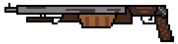
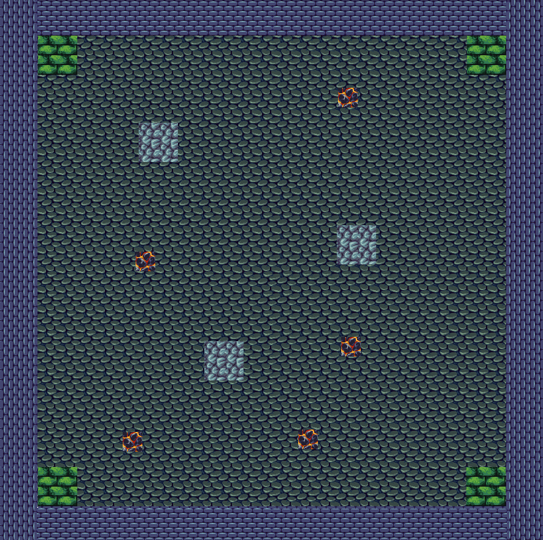

# Knight
- This is a project based on the game ***Soul Knight***, and is configured via **SDL**.

---

## 游戏指南

> ***For  You***:
> 
>       诸君，于游戏之境，且行且赏，领略其中雅趣，方不负此番妙境。
---

## 项目框架

```markdown
Knight/
│
├── README.md
│
├── head/
│   ├── Elements/
│   │   ├── Hero.h
│   │   ├── Monster.h
│   │   └── Weapon.h
│   ├── menu.h
│   ├── game.h
│   ├── common.h
│   └── main.h
│
├── rsc/
│   ├── background.png
│   ├── Fireball.png
│   ├── Func.png
│   ├── Hero.png
│   ├── Shotgun.png
│   └── svgafix.fon
│
├── src/
│   ├── Elements/
│   │   ├── Hero.h
│   │   ├── Monster.h
│   │   └── Weapon.h
│   ├── menu.h
│   ├── game.h
│   └── main.cpp
│
└── .gitignore
```

---

## 游戏元素

### 人物

> 

```c++
class Hero {
    int HP;
    int Shield;
    int Energy;
    int Speed;
    Weapon weapon;
    Postion Hero_pos;
public:
    Hero();
    ~Hero();
    void Move();
    void Attack();
}
```
```c++
struct Postion {
    double x;
    double y;
}
```

### 怪物
```c++
class Monster {
    int HP;
    int Speed;
    Weapon weapon;
    Postion Monster_pos;
public:
    Monster();
    ~Monster();
    void Move();
    void Attack();
}
```
### 武器

> 

```c++
struct Weapon {
    int AttackPower;
    int EnergyConsumed;
    int Speed;
    Direction dir;
}
```
```c++
struct Direction {
    int dx;
    int dy;
}
```
### 杂项
#### 药品
#### 菜单
#### 地牢场景

> 

#### 功能性页面

> 

